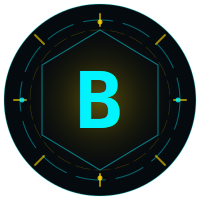

<div align="center">



# J.A.R.V.I.S

**Just A Rather Very Intelligent System**

Assistente pessoal de voz e texto, sci-fi, rodando no seu próprio servidor.

[](https://nextjs.org)
[](https://typescriptlang.org)
[](https://tailwindcss.com)
[](https://vercel.com)
[](LICENSE)

</div>

---

> Clone, configure suas chaves e tenha seu próprio Jarvis rodando em menos de 10 minutos.

---

## O que é isso

Um assistente pessoal que você hospeda. Sem assinaturas, sem dados de terceiros, sem rastreamento. Você conecta suas próprias contas (Spotify, Google, GitHub) e o Jarvis passa a controlar tudo por voz.

A interface é uma tela escura com um orbe 3D animado que reage ao que você está fazendo — ouvindo, processando, falando. A voz usa [ElevenLabs](https://elevenlabs.io) para síntese realista e [Groq](https://groq.com) para inferência rápida do LLM.

---

## Funcionalidades

**Voz e conversa**
- Ativação por palavra-chave: "Jarvis", "Ei Jarvis", "Olá Jarvis"
- Reconhecimento em português via Web Speech API (Chrome/Edge)
- Síntese de voz com ElevenLabs (voz Adam, grave) — fallback para Speech Synthesis nativa
- Histórico de contexto das últimas 20 mensagens por sessão

**Integrações**
- **Spotify** — tocar músicas/artistas/playlists, pausar, pular, controlar volume
- **Google Calendar** — criar eventos, listar agenda do dia/semana
- **Gmail** — resumo dos emails não lidos dos últimos N dias
- **GitHub** — listar PRs abertos, issues, commits recentes
- **Briefing matinal** — agenda + emails + clima em um único comando
- **Memória persistente** — salva preferências, fatos e tarefas no Supabase

**Interface**
- Orbe 3D com 320 partículas (distribuição de Fibonacci, projeção perspectiva)
- Mini player do Spotify com controles e barra de progresso
- Tipografia futurista: Orbitron + Share Tech Mono
- Grid animado, glow cyan, totalmente responsivo

---

## Stack

| Camada | Tecnologia |
|--------|-----------|
| Framework | Next.js 14 (App Router) |
| Linguagem | TypeScript 5 |
| Estilo | Tailwind CSS 3 |
| LLM | Groq — `llama-3.1-8b-instant` |
| TTS | ElevenLabs (`eleven_turbo_v2_5`) |
| Voz (input) | Web Speech API (nativa) |
| Memória | Supabase (PostgreSQL) |
| Deploy | Vercel |

**Dependências de runtime:**

```
next, react, react-dom
groq-sdk
@supabase/supabase-js
msedge-tts
```

---

## Pré-requisitos

- **Node.js 18+**
- Conta no [Groq](https://console.groq.com) — gratuita, sem cartão
- Conta no [ElevenLabs](https://elevenlabs.io) — plano gratuito tem 3 vozes
- Conta no [Supabase](https://supabase.com) — gratuita
- (Opcional) Conta Spotify Premium para controle de playback
- (Opcional) Projeto no Google Cloud para Calendar e Gmail
- (Opcional) Personal Access Token do GitHub

---

## Setup

### 1. Clone e instale

```bash
git clone https://github.com/rodrigoscharp/Own-Jarvis.git
cd Own-Jarvis
npm install
cp .env.local.example .env.local
```

### 2. Configure as variáveis de ambiente

Edite `.env.local` com suas chaves. Veja a [tabela completa](#variáveis-de-ambiente) abaixo.

### 3. Configure o Supabase

No painel do Supabase, abra o **SQL Editor** e execute:

```sql
create table jarvis_memories (
  id uuid primary key default gen_random_uuid(),
  content text not null,
  category text not null default 'general',
  created_at timestamptz default now()
);
```

A anon key padrão do Supabase já tem permissão de leitura e escrita nessa tabela.

### 4. (Opcional) Configure o Spotify

1. Acesse [developer.spotify.com/dashboard](https://developer.spotify.com/dashboard)
2. Crie um app — anote o **Client ID** e o **Client Secret**
3. Em **Redirect URIs**, adicione:
   - `http://localhost:3000/api/spotify/callback` (desenvolvimento)
   - `https://seu-dominio.vercel.app/api/spotify/callback` (produção)
4. Preencha `SPOTIFY_CLIENT_ID`, `SPOTIFY_CLIENT_SECRET` e `SPOTIFY_REDIRECT_URI` no `.env.local`
5. Com o servidor rodando, acesse `/api/spotify/login` para autorizar

### 5. (Opcional) Configure Google Calendar e Gmail

1. Acesse [console.cloud.google.com](https://console.cloud.google.com)
2. Crie um projeto e ative as APIs: **Google Calendar API** e **Gmail API**
3. Em **Credenciais**, crie um **OAuth 2.0 Client ID** (tipo: Web Application)
4. Adicione os URIs de redirecionamento:
   - `http://localhost:3000/api/calendar/callback`
   - `https://seu-dominio.vercel.app/api/calendar/callback`
5. Baixe as credenciais e preencha `GOOGLE_CLIENT_ID`, `GOOGLE_CLIENT_SECRET`, `GOOGLE_REDIRECT_URI`
6. Com o servidor rodando, acesse `/api/calendar/login` para autorizar

### 6. (Opcional) Configure o GitHub

1. Gere um **Personal Access Token** em [github.com/settings/tokens](https://github.com/settings/tokens)
2. Permissões necessárias: `repo`, `read:user`
3. Preencha `GITHUB_TOKEN`, `GITHUB_USER` e `GITHUB_DEFAULT_REPO`

### 7. Rode localmente

```bash
npm run dev
```

Acesse [http://localhost:3000](http://localhost:3000).

---

## Variáveis de ambiente

Copie `.env.local.example` para `.env.local` e preencha:

| Variável | Descrição | Obrigatória |
|----------|-----------|:-----------:|
| `GROQ_API_KEY` | Chave da API do Groq (LLM) | ✅ |
| `ELEVENLABS_API_KEY` | Chave da API do ElevenLabs (TTS) | ✅ |
| `ELEVENLABS_VOICE_ID` | ID da voz no ElevenLabs (ex: `pNInz6obpgDQGcFmaJgB` para Adam) | ✅ |
| `SUPABASE_URL` | URL do seu projeto Supabase | ✅ |
| `SUPABASE_ANON_KEY` | Chave pública do Supabase | ✅ |
| `SPOTIFY_CLIENT_ID` | Client ID do app Spotify | ⬜ |
| `SPOTIFY_CLIENT_SECRET` | Client Secret do app Spotify | ⬜ |
| `SPOTIFY_REDIRECT_URI` | URI de callback do Spotify OAuth | ⬜ |
| `GOOGLE_CLIENT_ID` | Client ID do Google Cloud | ⬜ |
| `GOOGLE_CLIENT_SECRET` | Client Secret do Google Cloud | ⬜ |
| `GOOGLE_REDIRECT_URI` | URI de callback do Google OAuth | ⬜ |
| `GITHUB_TOKEN` | Personal Access Token do GitHub | ⬜ |
| `GITHUB_USER` | Seu usuário GitHub | ⬜ |
| `GITHUB_DEFAULT_REPO` | Repositório padrão para consultas | ⬜ |
| `OPENWEATHER_API_KEY` | Chave da OpenWeather (briefing matinal) | ⬜ |
| `OPENWEATHER_CITY` | Cidade para previsão do tempo | ⬜ |

---

## Deploy na Vercel

1. Fork este repositório para a sua conta GitHub
2. Acesse [vercel.com/new](https://vercel.com/new) e importe o repositório
3. Na aba **Environment Variables**, adicione todas as variáveis do `.env.local`
4. Para as URIs de OAuth (Spotify e Google), use o domínio da Vercel:
   - `https://seu-projeto.vercel.app/api/spotify/callback`
   - `https://seu-projeto.vercel.app/api/calendar/callback`
5. Clique em **Deploy**

Cada push para `main` faz deploy automático.

---

## Como os comandos de voz funcionam

O Jarvis detecta ações pelo LLM usando tags estruturadas na resposta. Quando você pede algo como "toca Led Zeppelin", o modelo retorna:

```
[SPOTIFY:{"action":"play","query":"Led Zeppelin"}]
```

O frontend faz o parse dessa tag e chama a API correspondente. Nenhuma palavra-chave é hardcoded — o LLM decide qual ação usar com base no contexto.

**Tags disponíveis:**

| Tag | Exemplo | O que faz |
|-----|---------|-----------|
| `SPOTIFY` | `{"action":"play","query":"nome"}` | Controla o Spotify |
| `CALENDAR` | `{"action":"create","title":"Reunião","date":"2026-05-20","time":"15:00"}` | Cria eventos |
| `GMAIL` | `{"action":"summary","days":7}` | Resume emails |
| `GITHUB` | `{"action":"prs"}` | Lista PRs abertos |
| `TIMER` | `{"action":"start","minutes":25}` | Inicia contagem regressiva |
| `MEMORY` | `{"action":"save","content":"...","category":"preference"}` | Salva memória |
| `BRIEFING` | `{"action":"daily"}` | Briefing completo do dia |

---

## Personalizando o seu Jarvis

**Mudar a personalidade:**  
Edite o system prompt em `app/api/chat/route.ts`. É onde o Jarvis recebe sua identidade — nome, tom, idioma, instruções de comportamento.

**Mudar a voz:**  
No ElevenLabs, escolha qualquer voz disponível no seu plano e atualize `ELEVENLABS_VOICE_ID`. A variável `ELEVENLABS_API_KEY` já cuida da autenticação.

**Mudar o modelo LLM:**  
Em `app/api/chat/route.ts`, altere o campo `model`. O Groq suporta vários modelos — veja em [console.groq.com/docs/models](https://console.groq.com/docs/models).

**Adicionar novas integrações:**  
1. Crie uma rota em `app/api/sua-integracao/`
2. Defina uma nova tag no system prompt (ex: `[MINHA_TAG:{...}]`)
3. No `app/page.tsx`, adicione o parser e o handler da tag no dispatcher de ações

**Trocar o idioma:**  
O reconhecimento de voz usa `lang: 'pt-BR'` em `app/page.tsx`. Para inglês, mude para `en-US`. O system prompt também precisa ser ajustado para o idioma desejado.

---

## Estrutura do projeto

```
jarvis/
├── app/
│   ├── api/
│   │   ├── briefing/          # Briefing matinal (agenda + emails + clima)
│   │   ├── calendar/          # Google Calendar (OAuth + criação de eventos)
│   │   ├── chat/              # Endpoint principal do LLM
│   │   ├── github/            # PRs, issues, commits
│   │   ├── gmail/             # Resumo de emails
│   │   ├── memory/            # CRUD de memórias no Supabase
│   │   ├── music/             # Busca de músicas
│   │   ├── spotify/           # Spotify (OAuth + playback + now-playing)
│   │   └── tts/               # Síntese de voz (ElevenLabs)
│   ├── globals.css
│   ├── layout.tsx
│   └── page.tsx               # Interface principal e lógica de voz
├── components/
│   ├── Orb.tsx                # Orbe 3D animado (canvas)
│   └── MiniPlayer.tsx         # Mini player do Spotify
├── lib/
│   ├── google.ts              # Gerenciamento de tokens Google
│   ├── spotify.ts             # Gerenciamento de tokens Spotify
│   ├── supabase.ts            # Cliente e CRUD de memórias
│   └── time.ts                # Utilitários de timezone (Brasília UTC-3)
├── .env.local.example
├── tailwind.config.ts
└── next.config.mjs
```

---

## Boas práticas adotadas

- **TypeScript estrito** — interfaces tipadas para todos os estados, ações e respostas de API
- **Cleanup de recursos** — AbortController e event listeners removidos no unmount do componente
- **Cache em memória** — memórias do Supabase são cacheadas por 5 minutos para reduzir queries
- **Fallback de TTS** — se ElevenLabs falhar, usa Speech Synthesis nativa do navegador
- **MediaSource streaming** — áudio do ElevenLabs é reproduzido com baixa latência via streaming, sem esperar o arquivo completo
- **Debounce de fala** — 1.2s de debounce no reconhecimento para evitar submissões parciais
- **Sem secrets no cliente** — todas as chaves de API ficam exclusivamente nas rotas de servidor
- **OAuth com cookies HttpOnly** — tokens de refresh do Spotify e Google trafegam apenas em cookies seguros

---

## Limitações conhecidas

- **Web Speech API**: funciona bem no Chrome e Edge. Firefox e Safari têm suporte parcial ou ausente
- **Spotify**: requer conta **Premium** para controle de playback via API
- **ElevenLabs plano gratuito**: 3 vozes disponíveis (Adam, Arnold, Antoni) e limite mensal de caracteres
- **OAuth Google**: em modo de teste, a tela de consentimento exibe aviso; publique o app no Google para remover

---

## Licença

MIT — faça o que quiser com isso.
